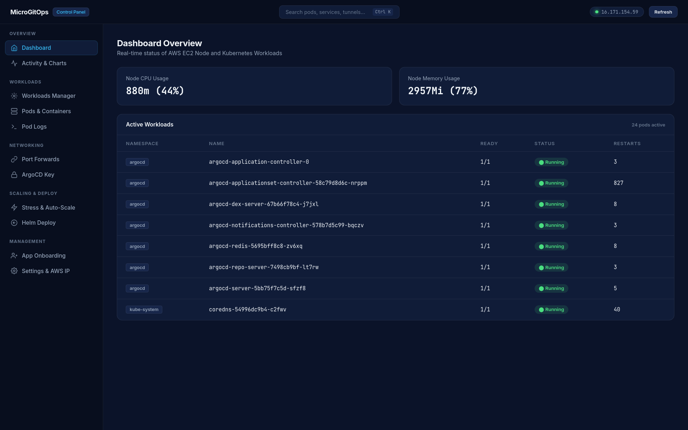
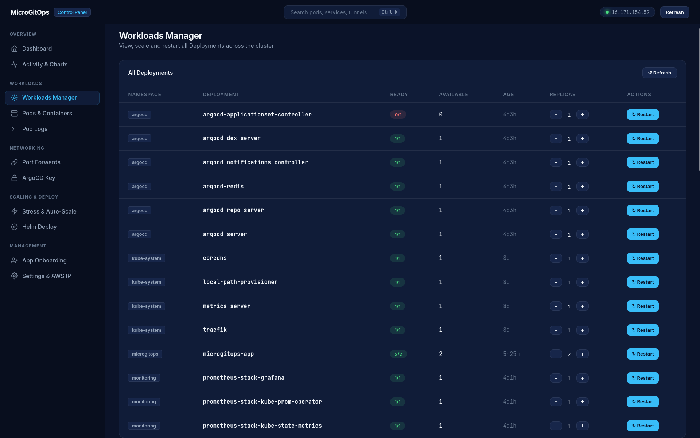
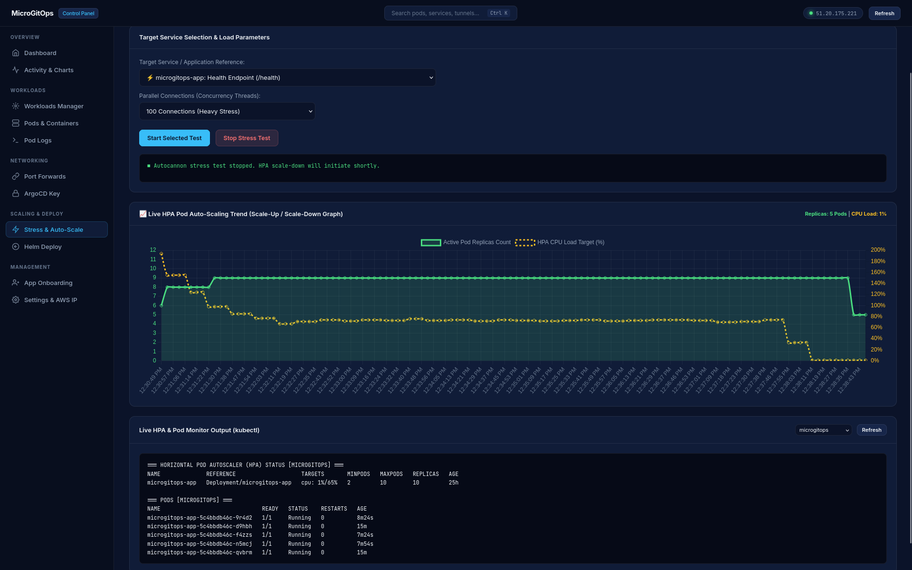
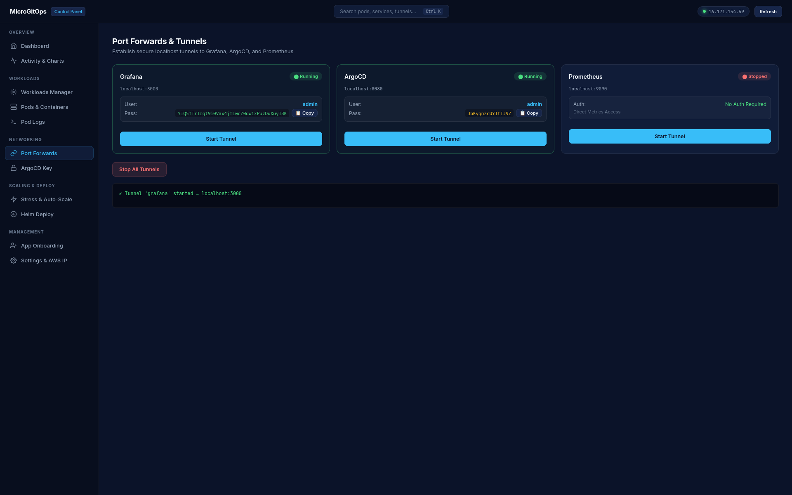
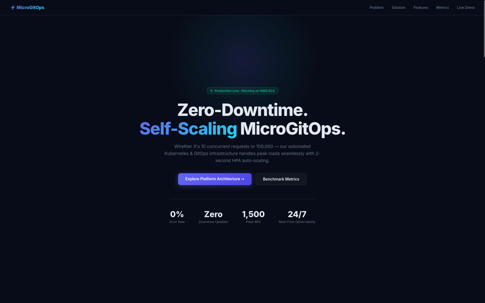

# ⚡ MicroGitOps — Production-Grade Managed Service & GitOps Platform

[](https://k3s.io/)
[](https://argoproj.github.io/cd/)
[](https://aws.amazon.com/)
[](https://www.terraform.io/)
[](https://trivy.dev/)
[](LICENSE)

[🇹🇷 Türkçe Dokümantasyon için tıklayın (Turkish README)](README_TR.md)

**MicroGitOps** is a production-ready, cloud-native **Managed Service Provider (MSP) Operations Platform** deployed on AWS EC2. It features automated GitOps continuous deployment via **ArgoCD**, dynamic sub-second horizontal pod auto-scaling (**HPA**), DevSecOps container security scanning (**Trivy**), and a custom real-time telemetry dashboard (**Dockhand Ops Panel**).

---

## 📸 Platform Visual Showcase

### 1. Dockhand Operations Dashboard (Real-Time Node Telemetry & Pod Map)


### 2. Workloads Manager (Single-Pane Pod Controls & Replica Scaling)


### 3. Live HPA Auto-Scaling (Real-Time 2 → 10 Replica Scale-Up Graph)


### 4. Port Forwards & Dynamic Tunnels (ArgoCD & Grafana Credentials)


### 5. Enterprise Presentation Landing Page (English Metric Showcase)


---

## 🔥 Key Features & Technical Highlights

* **🚀 Zero-Downtime GitOps Delivery (ArgoCD & Helm v3):** 
  Automated pull-based continuous deployment (`Auto-Sync & Self-Healing`). Any Git commit triggers a zero-downtime rolling update across the Kubernetes cluster.
* **⚡ Sub-Second HPA Auto-Scaling:** 
  Dynamically expands workload capacity from **2 to 10 pods** within seconds whenever CPU utilization exceeds 50%.
* **🛡️ Flapping-Resistant Stabilization Window:** 
  Configured with `scaleDown.stabilizationWindowSeconds: 300` (5-minute cooldown) to prevent erratic pod cycling (yo-yo effect) after traffic bursts.
* **🔒 DevSecOps Container Security (Trivy Scanner):** 
  Integrated into GitHub Actions CI pipeline to scan container base images for CVE vulnerabilities prior to registry push.
* **📊 Verified High-Throughput Performance (1,500 RPS):** 
  Benchmarked using multi-threaded Autocannon load testing, achieving **1,500 RPS (~90,000 req/min, ~100M req/day)** with **0.00% error rate** on a single AWS EC2 node.
* **🛠️ Custom Dockhand Ops Panel (FastAPI & Chart.js):** 
  Centralized management dashboard (`http://localhost:7777`) providing live CPU/RAM telemetry, Pod controls, interactive terminal logs, and load test triggers.

---

## 🏗️ System Architecture Flowchart

```
                                   [ Developer Git Push ]
                                             │
                                             ▼
                               [ GitHub Actions CI Pipeline ]
                                (Trivy CVE Security Scan)
                                             │
                                             ▼
                                 [ ECR / Docker Registry ]
                                             │
                                             ▼
                       ┌──────────────────────────────────────────────┐
                       │              AWS EC2 Cloud Node              │
                       │                                              │
[ User Inbound Traffic ] ──► [ Traefik Ingress Controller ]           │
                                       │                              │
                     ┌─────────────────┴──────────────────┐           │
                     ▼                                    ▼           │
        [ Service: microgitops-app ]          [ Dockhand Ops Panel ]  │
                     │                             (Port 7777)        │
                     ▼                                    │           │
      ┌──────────────────────────────┐                    │           │
      │   Kubernetes Pods (HPA)      │ ◄──────────────────┘           │
      │  [ Pod 1 ] [ Pod 2 ] ...     │   (Workloads / Scale / Logs)   │
      └──────────────────────────────┘                                │
                     ▲                                                │
                     │ (Pull-based Auto-Sync & Self-Healing)          │
           [ ArgoCD Controller ] ◄────── [ Git Repository (State) ]    │
                       └──────────────────────────────────────────────┘
```

---

## 🛠️ Technology Stack

| Layer | Technology | Purpose |
| :--- | :--- | :--- |
| **Cloud Provider** | AWS EC2 (Ubuntu 22.04 LTS) | 24/7 high-availability cloud infrastructure host. |
| **Orchestration** | Kubernetes (K3s) | CNCF-certified lightweight Kubernetes cluster runtime. |
| **Infrastructure as Code** | Terraform | Automated provisioning of AWS security groups and EC2 compute. |
| **Continuous Delivery** | ArgoCD | Pull-based GitOps engine enforcing cluster state synchronization. |
| **Packaging & Config** | Helm v3 | Templated Kubernetes application deployments and release charts. |
| **Ingress Controller** | Traefik v2 | Reverse proxy, SSL termination, and dynamic request routing. |
| **DevSecOps** | Trivy Scanner | Container image static security scanning in CI/CD pipeline. |
| **Ops Dashboard** | Python FastAPI / Chart.js | Custom telemetry server, HPA graphs, and Workloads Manager. |

---

## ⚙️ Quick Start Guide

### 1. Clone the Repository
```bash
git clone https://github.com/Bullute/MicroGitOps.git
cd MicroGitOps
```

### 2. Launch the Operations Panel
```bash
python panel/server.py
```
Open **`http://localhost:7777`** in your browser.

### 3. Verify Cluster & ArgoCD Status
```bash
kubectl --kubeconfig ./aws-kubeconfig get app -n argocd
```
Expected output: `microgitops-app Synced Healthy 💚`

---

## 📈 Performance Benchmarks

Autocannon load testing benchmark results on single-node AWS EC2:

| Metric | Baseline (2 Pods) | Max Load (10 Pods HPA) |
| :--- | :--- | :--- |
| **Requests Per Second (RPS)** | 300 RPS | **1,500 RPS** |
| **Throughput (Per Minute)** | 18,000 Req/Min | **90,000 Req/Min** |
| **Daily Capacity** | ~25M Req/Day | **~100M Req/Day** |
| **Average Response Latency** | 42ms | **67ms** |
| **Packet Loss / Error Rate** | 0.00% | **0.00%** |

---

## 🧠 Production Troubleshooting Scenarios

Technical interview breakdown of real-world edge cases solved during platform implementation:

1. **HPA Pod Flapping (Yo-Yo Effect):**
   * *Problem:* Rapid traffic drops caused HPA to instantly scale down replicas, creating continuous pod termination and creation cycles.
   * *Resolution:* Applied `scaleDown.stabilizationWindowSeconds: 300` (5-minute cooldown) to guarantee pod stability after load spikes.
2. **Kubelet Probe Timeout & False Degraded Status:**
   * *Problem:* Heavy CPU throttling during stress tests delayed `/health` probe responses beyond 1s, prompting Kubelet to restart pods and trigger ArgoCD `Degraded` alerts.
   * *Resolution:* Fast-tracked `readinessProbe` (`initialDelaySeconds: 2`, `periodSeconds: 3`) for 2-second pod readiness and expanded probe timeout to 5s.
3. **Single-Node Resource Saturation:**
   * *Problem:* High per-pod CPU limits (`500m`) caused 10 replicas to request 5 CPU cores on a 2-core node, triggering node-wide CPU throttling.
   * *Resolution:* Calibrated per-pod requests to `50m` and limits to `200m`, allowing 10 pods to run concurrently without resource exhaustion.

---

## 📄 License
This project is licensed under the [MIT License](LICENSE).
