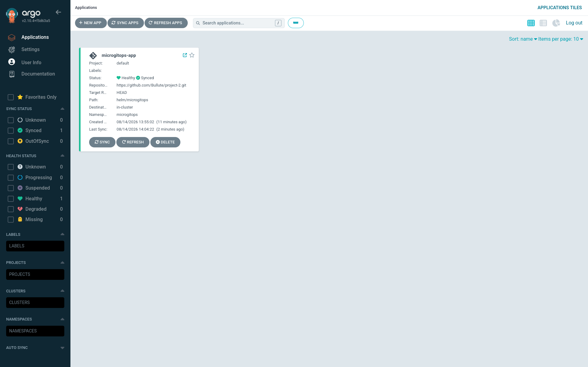
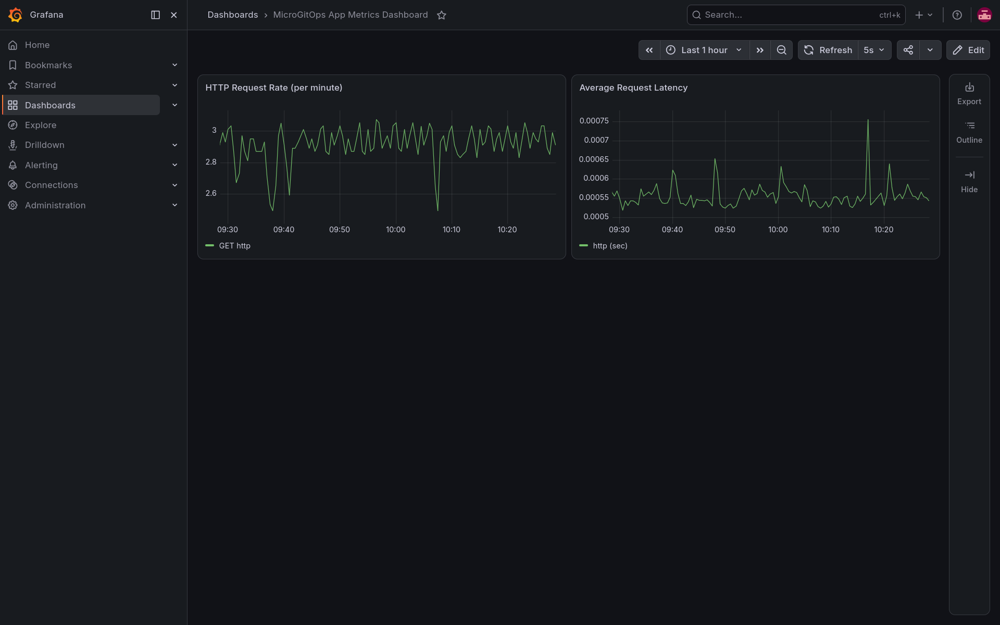

# 🚀 MicroGitOps Platform: Cloud-Native DevOps & GitOps Architecture

A production-grade, hardened, and highly observable GitOps deployment platform designed to package, secure, deploy, and monitor scalable APIs on AWS EC2 nodes orchestrating on lightweight Kubernetes (K3s).

This project demonstrates modern DevSecOps, Infrastructure-as-Code (IaC), GitOps, and Site Reliability Engineering (SRE) principles in action.

---

## 🏗️ System Architecture & Workflow

The platform spans from local development, to continuous quality checks, automated GitOps delivery, and final server-health monitoring in the AWS cloud. Below is the Mermaid-rendered model (natively supported by GitHub):


---

## 🛡️ Core Highlights & Features

1. **Application Hardening & Telemetry:**
   * Built with **FastAPI** leveraging Prometheus middleware instrumentation (`/metrics`) and Kubernetes liveness/readiness probes (`/health`).
   * **Hardened Dockerfile:** Employing multi-stage builds (`builder` -> `runner` stages) to omit compilation compilers in production, running under non-privileged UID `10001` (non-root context) to protect host kernels.

2. **Continuous Integration (CI):**
   * Configured via **GitHub Actions** (`ci.yml`) to enforce code formatting using `Ruff` and static security scanning for CVE dependencies using `Trivy`.

3. **Infrastructure as Code (IaC):**
   * Deployed via **Terraform** defining Kubernetes namespaces, secrets, and configuration maps dynamically targeting cluster environments.

4. **Continuous Delivery (CD):**
   * Managed via **Helm Charts** defining scalable templates (Deployments, Services, Ingresses, HPA, and ServiceMonitors) synchronized automatically onto the cluster via **ArgoCD**.

5. **Site Reliability Engineering (SRE):**
   * Deployed on a memory-constrained AWS EC2 `t3.micro` (1 GB RAM) instance.
   * Diagnosed and resolved Out-Of-Memory (OOM) crashing by configuring a **2 GB Linux Swap file** (`/swapfile`) to stabilize the OS.

---

## 📸 Platform Previews & Dashboards

Below are the live dashboard captures verifying the successful GitOps synchronization and the dynamic load testing metrics on our AWS cluster:

### 1. ArgoCD GitOps Sync Status


### 2. Grafana Observability Dashboard (Under Sleep-Wave Load Test)


---

## 📂 Repository Structure

```text
├── .github/workflows/
│   └── ci.yml               # GitHub Actions CI pipeline rules (Ruff & Trivy)
├── terraform/
│   ├── main.tf              # Terraform manifests (Namespaces, Secrets, ConfigMaps)
│   ├── providers.tf         # K8s provider bindings (AWS remote Kubeconfig target)
│   └── variables.tf         # Parameter maps
├── helm/microgitops/
│   ├── Chart.yaml           # Helm metadata
│   ├── values.yaml          # Variables panel (Replica Count, CPU/RAM configuration)
│   └── templates/           # Templates (deployment, service, ingress, HPA, servicemonitor)
├── grafana/
│   └── dashboard.json       # Visual JSON model of our metrics dashboard
├── main.py                  # FastAPI server with Prometheus middleware
├── Dockerfile               # Production multi-stage Docker build recipe
└── README.md                # Project documentation
```

---

## ⚙️ How to Deploy & Verify

### 1. Local Container Verification (Docker)
Build and run the application locally to test the API endpoints:
```bash
# Build the container
docker build -t microgitops:v1 .

# Run the container mapping ports locally
docker run --rm -p 8000:8000 microgitops:v1
```
Access endpoints:
* **Home:** `http://localhost:8000/`
* **Sağlık Kontrolü:** `http://localhost:8000/health`
* **Metrikler:** `http://localhost:8000/metrics`

### 2. Infrastructure Deployment (Terraform & Helm)
Connect to the AWS K3s cluster and run:
```bash
# Apply Terraform foundations
cd terraform && terraform init && terraform apply -auto-approve

# Install Helm App Stack
cd .. && helm upgrade --install microgitops-release ./helm/microgitops -n microgitops
```

### 3. Monitoring Verification
Once targets are scraped by Prometheus, importing the `grafana/dashboard.json` dashboard design allows you to view:
* HTTP Request Rates (counts/success)
* Request Duration Latencies (percentiles)
* CPU & memory consumption profiles
